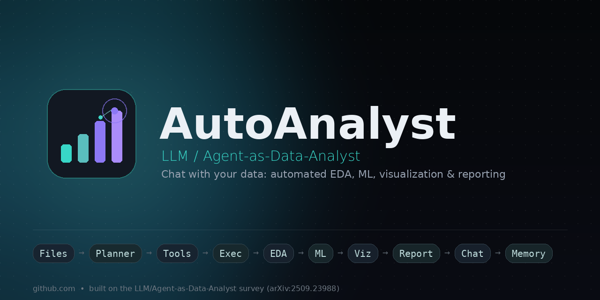

# AutoAnalyst

A working implementation of the **LLM/Agent-as-Data-Analyst** pipeline you sketched:

```
Multiple files → Agent planner → Tool selection → Python execution
→ EDA → ML → Visualization → Report generation
→ Chat interface → Memory → Deployment
```

Each stage is grounded in a concept from *"LLM/Agent-as-Data-Analyst: A Survey"*
(Tang et al., 2025, arXiv:2509.23988):

| Pipeline stage        | Module                      | Survey grounding |
|------------------------|------------------------------|-------------------|
| Multiple files          | `autoanalyst/data_loader.py` | Structured / semi-structured / unstructured data taxonomy (Sec. 1.3) — O1 cross-modal open-world support |
| Agent planner            | `autoanalyst/planner.py`     | Task/action-graph decomposition, e.g. Data Interpreter (Sec. 2.1) — O2 NL-based interaction |
| Tool selection            | `autoanalyst/tools.py`       | Tool-agnostic architecture (L2 → flexible tools) |
| Python execution           | `autoanalyst/executor.py`    | NL2Code execution surface (PACHINCO, Data Interpreter) |
| EDA                          | `autoanalyst/eda.py`         | Semantic-aware profiling/cleaning (L3 → O3 semantic operators) |
| ML                             | `autoanalyst/ml.py`          | End-to-end table-driven modeling (Sec. 2.1 "LLM for Semantic Analysis") |
| Visualization                   | `autoanalyst/visualization.py` | Chart generation, cf. Chart-to-Code (Sec. 4.1) |
| Report generation                 | `autoanalyst/report.py`      | Post-processing / down-stream synthesis (Fig. 3) |
| Chat interface                      | `chat_app.py`                 | NL interface, tool-agnostic interaction (O2) |
| Memory                                | `autoanalyst/memory.py`      | Multi-turn continuity for the agent |
| Deployment                             | `Dockerfile`, `docker-compose.yml` | — |

## Architecture

`AutoAnalystAgent` (in `autoanalyst/orchestrator.py`) is the single facade:

1. `load_files(paths)` — ingests any mix of CSV/XLSX/JSON/Parquet/TXT into a
   uniform in-memory registry (`DataLoader`) and produces a manifest
   (shape, dtypes, modality) that is fed to the planner.
2. `chat(user_message)` — each turn:
   - **Planner** (`LLMPlanner` via Claude if `ANTHROPIC_API_KEY` is set, else
     a deterministic `RulePlanner`) turns the NL request + manifest into a
     `Plan` — an ordered list of `Step`s, each bound to a tool name.
   - **Tool selection**: each step's `tool` field is looked up in the
     `ToolRegistry` (decoupled — new tools can be registered without
     touching the planner).
   - **Execution**: tools run against a shared `PipelineContext` holding the
     dataframe(s), accumulated results, and artifact paths. `run_code` lets
     the agent (or a user) execute arbitrary pandas/sklearn snippets.
   - **EDA / ML / Visualization**: `profile_data`, `clean_data`,
     `train_model`, `plot_chart` populate `context.results`.
   - **Report generation**: `generate_report` assembles everything into
     Markdown, embedding chart paths.
   - **Memory**: every turn (and the resulting report) is persisted to
     `sessions/<session_id>.json` via `ConversationMemory`.
3. `chat_app.py` — a Streamlit UI wrapping all of the above with file
   upload, chat, inline chart rendering, and an ad-hoc code cell.

## Quickstart

```bash
pip install -r requirements.txt

# Chat UI
streamlit run chat_app.py

# or CLI
python main.py --files data/sales.csv --query "explore this data and predict revenue"
```

Set `ANTHROPIC_API_KEY` to let Claude write the plan (task decomposition);
without it, AutoAnalyst falls back to a deterministic keyword-based planner
so the whole pipeline still works offline.

## Deployment

```bash
docker compose up --build
# UI at http://localhost:8501
```

or plain Docker:

```bash
docker build -t autoanalyst .
docker run -e ANTHROPIC_API_KEY=$ANTHROPIC_API_KEY -p 8501:8501 autoanalyst
```

## Extending

Register a new tool anywhere:

```python
from autoanalyst.tools import ToolRegistry

def my_tool(context, **args):
    df = context.primary_dataframe()
    ...
    return {"ok": True}

registry.register("my_tool", my_tool, "description for the planner")
```

The `RulePlanner`/`LLMPlanner` only need the tool's name and description to
start selecting it — no other code changes required (tool-agnostic design,
per survey L2 → "Flexible Tools").

## Known limitations

- `executor.py` provides a *lightweight* sandbox (restricted builtins),
  suitable for trusted single-user/dev use — not a hardened security
  boundary for executing arbitrary untrusted code in production.
- `ml.py` ships a single baseline model (RandomForest) with auto
  classification/regression detection; swap in more estimators as needed.
- `memory.py` uses flat JSON files; replace with a proper DB/vector store
  for large-scale, multi-user deployments.
